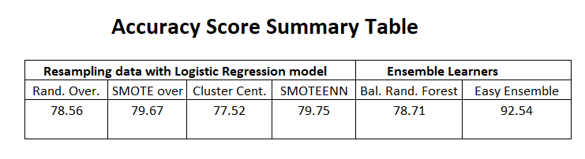
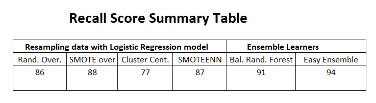
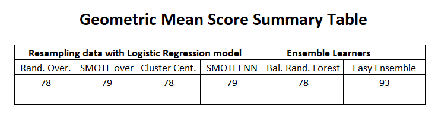
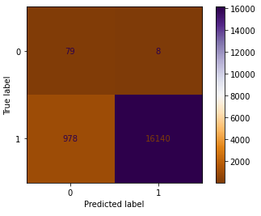

# lendingclub_ml

This repository is to explore results of different Machine learning techniques into risk loan classification.

The different techniques were included in two separate notebooks.

&ensp; **notebook 1:** named credit_risk_resampling \
&ensp; **notebook 2:** named credit_risk_ensemble 

### **Notebook 1: credit_risk_resamplig:**
In this notebook, a series of sampling balancing techniques are tested to compare their results using the Logistic Regression (machine learning) process. The sampling balancing tested methods are: 1) Random Oversampling, 2) SMOTE Oversampling, 3) Undersampling and 4) Combination Resampling.

### **Notebook 2: credit_risk_ensemble:**
In this notebook, the same dataset is passed thru 2 new predictive models with incorporated resampling techniques: **Balanced Random Forest Classifier** (which randomly undersamples the data) and **Easy Ensemble Classifier** (which applies bootstrap resampling combined with random under sampling).

## Results

&ensp; **Accuracy:** Considering the balanced accuracy score, the model that scores highest is Easy Ensemble Classifier (92.54). Refer to table 1 for the summary of the Accuracy scores for all 6 models. This signifies that this model had the best overall proportion of correct predictions.

  Table 1 

&ensp; **Recall Score:** The model Easy Ensemble Classifier surpassed all the models with a score of 94, which in turn indicates that the model had lowest False negative (FN) among all the analysis.

  Table 2 

&ensp; **Geometric mean Score:** In terms of Geometric mean, the model Easy Ensemble Classifier also outperformed the predictions of the other model with a score of 93.

  Table 3 

## Conclusion

The best predictive model for the Classification problem is the Easy Ensemble Classifier, since it scored highest on Accuracy, Recall and Geometric mean.

Below, the Confusion Matrix display that resulted from the model **Easy Ensemble Classifier**.

  Easy Ensemble Classifier Confusion Matrix 

  

___
## Resources
The data is extracted from LendingClub.